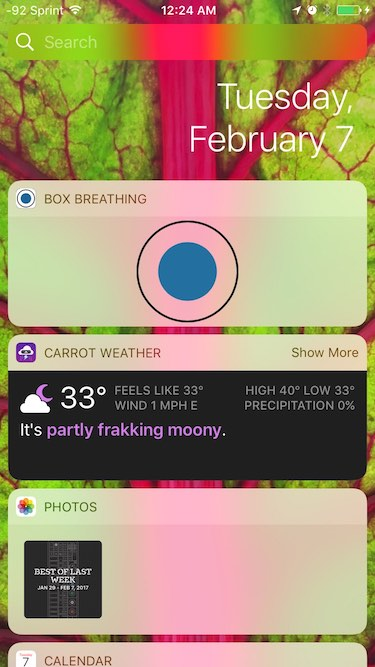

# Box Breathing (widget for iOS)

Creates a widget animation to sync your breath with. Based on [quitkit.com](http://quietkit.com/box-breathing/).

### Directions:

1. Install the app.
1. Go to your 'widget' screen, scroll to the bottom, and add "Box Breathing".
1. As the circle expands, inhale for 4 seconds.
1. As the circle stays expanded, hold your lungs for 4 seconds.
1. As the circle shrinks, exhale for 4 seconds.
1. As the circle is contracted, hold your lungs for 4 seconds.
1. Repeat steps 3-7 to calm down and refocus.

